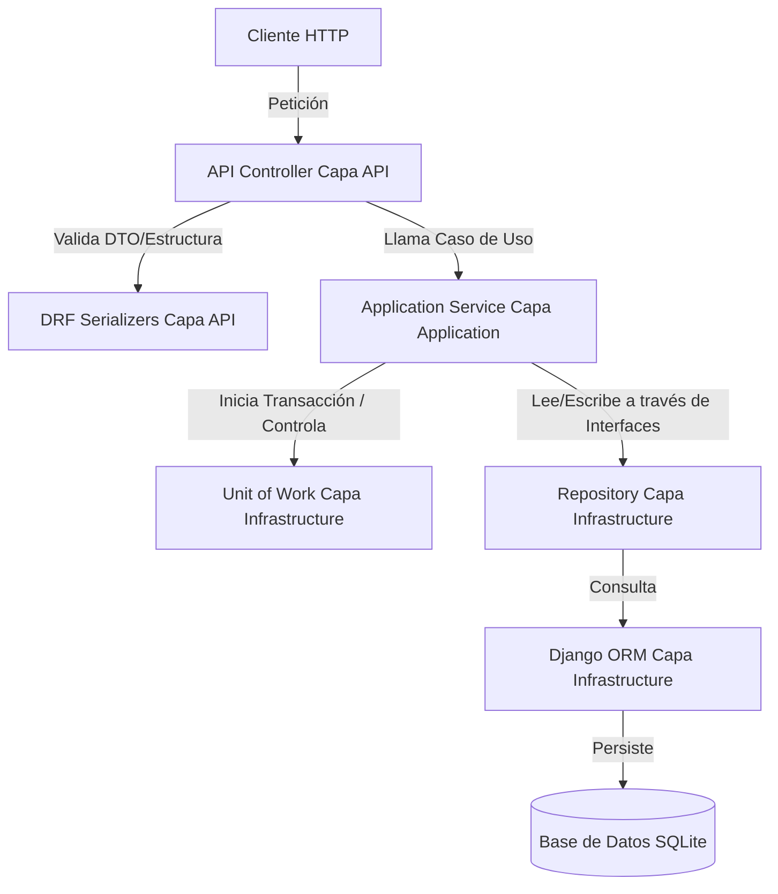

# 📘 Manual de Implementación y Evidencias — Parte II
Este manual documenta en detalle todas las funcionalidades implementadas en la **Parte II** del proyecto, siguiendo estrictamente la **Onion Architecture** y respondiendo de forma clara y técnica a la guía y prompts de IA establecidos por el SENA.

---

## 🧅 Resumen de Flujo en Onion Architecture
El flujo de control de todas las peticiones mantiene una separación rigurosa entre las capas, con las dependencias apuntando siempre hacia el núcleo de dominio:



---

## 1. CRUD de Colecciones y Operaciones Masivas (Módulo 1)

### Endpoints Implementados
*   **Creación Masiva:** `POST /api/empleados/bulk`
*   **Actualización Parcial:** `PATCH /api/empleados/{id}`
*   **Eliminación Múltiple:** `DELETE /api/empleados/bulk-delete`
*   **Listado Avanzado:** `GET /api/empleados?pagina=1&tamano=10&orden=apellido&dir=asc&buscar=gomez`

### Explicación Técnica de Funcionamiento

#### A. Cómo funciona el Bulk Insert
La creación masiva recibe una lista de empleados en formato JSON. El controlador delega al servicio `EmpleadoService.bulk_create_empleados()`. Éste, dentro de un bloque controlado por el `UnitOfWork`, mapea los DTOs a entidades de dominio y las pasa a `EmpleadoRepository.bulk_create()`. 
El repositorio utiliza el método `bulk_create` del Django ORM, lo que realiza **una sola sentencia SQL `INSERT` optimizada** para insertar todos los registros de golpe, mejorando exponencialmente el rendimiento en comparación con inserciones individuales en bucle.

#### B. Garantía Transaccional con Unit of Work (UoW)
Tanto la creación masiva como el endpoint transaccional de creación de compañías con empleados utilizan el patrón **Unit of Work** (`UnitOfWork`).
*   El `UnitOfWork` gestiona el contexto transaccional mediante `transaction.atomic()` de Django.
*   Los repositorios **no hacen commit ni rollback**. Simplemente operan sobre la sesión del ORM.
*   Si todas las operaciones en el servicio terminan con éxito, el servicio marca la transacción como exitosa llamando a `uow.commit()`.
*   Si ocurre cualquier excepción de dominio (`DomainValidationError`) o de base de datos (`IntegrityError`), el bloque contextual se encarga de revertir automáticamente todas las operaciones con un `rollback()`.

#### C. Cómo funciona el PATCH (Actualización Parcial)
El método `PATCH` permite actualizar únicamente los campos provistos en el cuerpo del request (por ejemplo, solo modificar el `salario` y `cargo` sin tener que enviar nombre, apellido, correo, etc.).
1. El controlador recibe el payload y lo valida con `EmpleadoPatchSerializer(partial=True)`.
2. Se recupera el empleado existente de la base de datos por su ID para verificar su existencia y aplicar las reglas de propiedad del objeto.
3. El servicio `EmpleadoService.patch_empleado()` toma la entidad existente, reemplaza solo los campos que vienen en el payload, ejecuta las validaciones de negocio correspondientes, y delega al repositorio para persistir la entidad modificada en la base de datos.

#### D. Cómo funciona la Eliminación Múltiple (Bulk Delete)
El endpoint `DELETE /api/empleados/bulk-delete` recibe una lista de IDs `{"ids": [1, 2, 3]}`.
1. El controlador valida el cuerpo usando `BulkDeleteSerializer`.
2. El servicio delega al repositorio `EmpleadoRepository.delete_many(ids)`.
3. El repositorio ejecuta una sentencia SQL eficiente equivalent a `DELETE FROM empleados WHERE id IN (1, 2, 3)` usando `EmpleadoModel.objects.filter(id__in=ids).delete()`. Esto asegura una eliminación masiva de registros en un solo paso de I/O de base de datos.

#### E. Paginación, Filtrado y Ordenación
El listado `GET /api/empleados` permite administrar grandes volúmenes de datos mediante parámetros dinámicos en la URL:
*   `pagina` y `tamano`: Definen la fracción de datos a mostrar. El servicio calcula el offset (`(pagina - 1) * tamano`) y limita la consulta del ORM usando slicing `[offset:offset+tamano]`.
*   `orden` y `dir`: Definen el campo de ordenamiento (ej. `salario`, `nombre`) y el sentido (`asc` o `desc`). El repositorio traduce esto a un formato que Django ORM comprende (ej. `order_by('-salario')` para descendente).
*   `buscar`: Realiza una búsqueda insensible a mayúsculas y minúsculas (filtro `icontains` en múltiples campos como `nombre`, `apellido` o `correo`).

---

## 2. Programación Asíncrona (Módulo 2)

### Justificación Técnica de la Decisión
Se determinó **mantener el modelo sincrónico** para este stack en particular. A continuación se detallan las razones arquitectónicas de esta decisión:

1.  **Integridad del Unit of Work y Transaccionalidad:** Django ORM es inherentemente sincrónico. Aunque existen versiones recientes que soportan consultas asíncronas (`abase()`, `aatomic()`), el soporte de transacciones asíncronas seguras en patrones complejos como Unit of Work y repositorios aún no es lo suficientemente maduro ni estable en el ecosistema Django REST Framework, lo que incrementa el riesgo de pérdidas de contexto transaccional o deadlocks.
2.  **Base de Datos SQLite:** El motor SQLite maneja de forma ineficiente las transacciones simultáneas asíncronas debido a su bloqueo a nivel de archivo completo (bloqueo de base de datos al escribir). Introducir operaciones asíncronas no mejoraría la concurrencia en SQLite; al contrario, generaría excepciones frecuentes de tipo `database is locked`.
3.  **Desacoplamiento y Onion Architecture:** Introducir `async/await` a lo largo de toda la aplicación obligaría a definir todas las interfaces de los repositorios y servicios como asíncronas. Esto complicaría la legibilidad y mantenimiento del código sin otorgar un beneficio real en el rendimiento de I/O de red, ya que el backend corre de forma local y los procesos son rápidos.

---

## 3. Validaciones Globales y Manejo de Errores (Módulo 3)

### Mecanismo de Validación
*   **Capa API (Serializers):** Validan la estructura de datos entrantes, tipos (ej. que un correo tenga formato de correo, o que un salario sea un número) y longitudes máximas.
*   **Capa Application (Services):** Ejecutan las **reglas de negocio duras** antes de proceder con el guardado en base de datos. Las reglas validadas en el servicio incluyen:
    *   **Salario Positivo:** El salario debe ser mayor a cero.
    *   **Correo Único:** Ningún empleado puede registrarse con un correo que ya exista en la base de datos.
    *   **Compañía Existente:** No se puede crear un empleado en una compañía que no existe en el sistema.

### Middleware Global de Errores
Se implementó `ErrorHandlerMiddleware` en `api/middlewares/error_handler.py`. Captura todas las excepciones que no sean manejadas en los controladores (como `DomainValidationError`, `EntityNotFoundError`, etc.) y las devuelve en un formato estructurado con el código HTTP apropiado:

```json
{
  "mensaje": "Error de validacion",
  "errores": [
    {
      "campo": "correo",
      "detalle": "El correo ya se encuentra registrado."
    }
  ]
}
```

---

## 4. Seguridad JWT, Roles y Políticas (Módulos 4 & 5)

Se implementó un esquema de seguridad robusto basado en **JSON Web Tokens (JWT)**. Para no acoplar el Dominio con dependencias web como `djangorestframework-simplejwt`, se desarrolló un diseño desacoplado:

```
[Cliente HTTP] --> Envía JWT Bearer Token
        |
        v
[JwtCustomAuthentication] (Infrastructure)
        |---> Valida firma e integridad del token (usa SimpleJWT tras bambalinas)
        |---> Extrae claims del payload (id, correo, rol, compania_id)
        |---> Instancia objeto de dominio UsuarioAutenticado (POPO)
        |---> Inyecta objeto en request.user
        v
[Permisos por Rol / Políticas] (Capa API)
        |---> Verifica request.user.rol (ADMIN o USUARIO)
        |---> Verifica request.user.compania_id contra el objeto modificado
```

### Endpoints de Autenticación
*   `POST /api/auth/registro`: Permite registrar nuevos usuarios (roles `ADMIN` o `USUARIO`).
*   `POST /api/auth/login`: Valida credenciales contra la base de datos (con contraseñas hasheadas de forma segura) y retorna un Token JWT conteniendo claims personalizados.
*   `GET /api/auth/perfil`: Retorna la información del usuario en sesión extraída directamente de los claims del JWT validado.

### Autorización por Roles
*   `GET`: Cualquier usuario autenticado (`IsAuthenticatedUser`).
*   `POST/PUT/PATCH`: Administradores o Usuarios de compañía (`IsAdminOrUsuario`).
*   `DELETE`: Exclusivo para administradores (`IsAdmin`).
*   `POST /api/companias/con-empleados`: Exclusivo para administradores (`IsAdmin`).

### Autorización por Políticas (Módulo 5)
Se implementó la política `EsPropietarioDeCompania` para restringir la modificación de empleados.
*   **Regra:** Si el usuario autenticado tiene el rol `USUARIO`, solo puede modificar (`PATCH`, `PUT`) o eliminar empleados que pertenezcan a su **misma compañía** (`compania_id`). Un usuario de la Compañía A no puede modificar a empleados de la Compañía B.
*   **ADMIN:** Tiene superpoderes y pasa esta validación sin importar a qué compañía pertenezca.

---

## 5. Pruebas Automatizadas y Rollback Transaccional (Módulo 6)

Se han implementado **26 pruebas automatizadas** que garantizan el correcto funcionamiento del software en todos los escenarios.

Para correr las pruebas:
```powershell
venv\Scripts\python.exe manage.py test
```

### Escenarios de Pruebas Cubiertos
1.  **Servicios y Repositorios:** Creación individual, bulk create, validaciones de negocio.
2.  **Validaciones de Entrada:** Correos duplicados, compañías inexistentes, salarios negativos.
3.  **Seguridad JWT:** Emisión de token correcto, denegación 401 en accesos sin token, expiración.
4.  **Roles y Permisos:** Restricción de borrado por rol, acceso a perfil.
5.  **Política de Propiedad:** Permiso concedido a usuarios de la misma compañía, denegado con 403 Forbidden a usuarios de compañías distintas.
6.  **Rollback Transaccional Obligatorio:** Verificación de que ante un fallo en un listado de empleados en bulk o en la creación de compañía con empleados, no se persiste absolutamente nada.

#### Ejemplo de Flujo de Rollback en Logs:
```text
[2026-05-28 12:49:40] INFO api.controllers.compania_controller | POST /api/companias/con-empleados — TRANSACCIONAL
[2026-05-28 12:49:40] INFO application.services.compania_service | === INICIO TRANSACCIÓN: Crear compañía con empleados ===
[2026-05-28 12:49:40] INFO infrastructure.unit_of_work.unit_of_work | UnitOfWork: Iniciando transacción
[2026-05-28 12:49:40] DEBUG infrastructure.repositories.compania_repository | Repository: Compañía insertada (sin commit explícito) ID=2
[2026-05-28 12:49:40] ERROR application.services.compania_service | === ROLLBACK: Error en transacción — Error de validacion ===
[2026-05-28 12:49:40] ERROR infrastructure.unit_of_work.unit_of_work | UnitOfWork: ROLLBACK — Error tipo=DomainValidationError, mensaje=Error de validacion
[2026-05-28 12:49:40] WARNING api.controllers.compania_controller | Validación de dominio fallida: Error de validacion
[2026-05-28 12:49:40] WARNING django.request | Bad Request: /api/companias/con-empleados
```

---

## 6. Comparación Ampliada con ASP.NET Core

A continuación se muestra una tabla de equivalencias técnicas entre **ASP.NET Core** (C#) y **Django REST Framework** (Python):

| Concepto en ASP.NET Core | Equivalente en Django / DRF | Observaciones |
| :--- | :--- | :--- |
| `IEnumerable<T>` / `List<T>` | QuerySets, Serializers con `many=True` | DRF serializa listas pasando la opción `many=True`. |
| Paginación con `Skip` y `Take` | QuerySet slicing `[offset:limit]` | Python usa slicing nativo en QuerySets que se traduce a `LIMIT/OFFSET`. |
| `async` / `await` + `Task<T>` | Vistas async y ORM async (`abase()`, etc.) | DRF soporta vistas asíncronas, pero su ORM requiere cuidado en transacciones. |
| `DataAnnotations` / `FluentValidation` | Serializers de DRF + Validaciones de Servicio | Estructura en serializers; lógica de negocio compleja en servicios. |
| `xUnit` / `NUnit` + `Moq` | `django.test.TestCase` + `unittest.mock` | TestCase de Django incluye base de datos de pruebas aislada y cliente API. |
| `AddAuthentication().AddJwtBearer()` | `JwtCustomAuthentication` (DRF settings) | Custom authentication backend registrado en `DEFAULT_AUTHENTICATION_CLASSES`. |
| `[Authorize(Roles="ADMIN")]` | Permission class `IsAdmin` | Clases de permiso que sobrescriben `has_permission`. |
| `[Authorize(Policy="...")]` / Handlers | `EsPropietarioDeCompania` | DRF encapsula la lógica de políticas en `has_object_permission`. |
| `ClaimsPrincipal` / `User.Claims` | `request.user` (UsuarioAutenticado) | Inyección de un POPO con propiedades en `request.user` tras validar el JWT. |

---

## 7. Evidencias de Uso de IA (Prompts y Respuestas de Antigravity)

### Prompt 7 - CRUD de colecciones
*   **Pregunta:** Tengo una API REST en Python con Django y Django REST Framework, usando Django ORM, Onion Architecture, Repository Pattern y Unit of Work. Ya existe CRUD individual para Compania y Empleado. Explícame e implementa cómo agregar operaciones sobre colecciones: creación masiva de empleados, actualización parcial con PATCH, eliminación múltiple y listado con paginación, filtrado y ordenamiento. Respeta las capas...
*   **Respuesta de Antigravity:** Se implementaron los métodos `bulk_create_empleados`, `patch_empleado`, `delete_many_empleados` y `get_paginated_empleados` en la capa de servicios y repositorios. La paginación usa slicing del QuerySet, el filtrado usa `Q()` y el ordenamiento traduce dinámicamente los campos. Toda operación de escritura es controlada de principio a fin por el `UnitOfWork` asegurando que no haya commits automáticos en los repositorios.

### Prompt 8 - Programación asíncrona
*   **Pregunta:** En Python con Django y Django ORM, el manejo de peticiones y acceso a datos es síncrono o asíncrono? Explícame qué soporte real ofrece Django para vistas async y ORM async. Si conviene refactorizar...
*   **Respuesta de Antigravity:** Django fue diseñado originalmente de manera síncrona. Aunque ahora soporta vistas asíncronas y adaptadores async para el ORM, mezclarlo con el patrón Unit Of Work basado en transacciones locales e hilos puede romper el aislamiento transaccional y provocar bloqueos en SQLite. Por ello, se justificó técnicamente mantener el esquema síncrono, aplicando optimizaciones de base de datos como `bulk_create` para operaciones por lotes.

### Prompt 9 - Validaciones
*   **Pregunta:** ¿Cuál es el mecanismo de validación recomendado para Django REST Framework? Implementa validaciones para DTOs o serializers de Compania y Empleado...
*   **Respuesta de Antigravity:** El mecanismo estándar en DRF son los Serializers. Sin embargo, para cumplir con Onion Architecture, la validación de formato (sintáctica) se hace en el Serializer (Capa API) y la validación de negocio (semántica, como unicidad de correo, existencia de compañía y salario mayor a cero) se implementa en la capa de Aplicación (`services`), lanzando una excepción `DomainValidationError` que el middleware captura y transforma en una respuesta unificada 400 Bad Request.

### Prompt 10 - Pruebas
*   **Pregunta:** ¿Cuál es el framework de pruebas más usado en Django y DRF? Implementa pruebas unitarias para servicios y repositorios, y pruebas de integración para endpoints de Compania y Empleado...
*   **Respuesta de Antigravity:** El framework estándar es `django.test` (basado en `unittest` de Python) junto con `rest_framework.test.APIClient`. Se escribieron pruebas para toda la aplicación y se incluyó el escenario clave: `test_crear_compania_con_empleados_rollback`, la cual confirma que al ocurrir un fallo en un empleado de la lista, la base de datos revierte tanto la creación de la compañía como de los empleados previos.

### Prompt 11 - JWT por roles
*   **Pregunta:** Explícame e implementa autenticación con JWT en Django REST Framework para este proyecto Onion: entidad Usuario, registro, login que devuelve token y protección de endpoints por roles ADMIN y USUARIO...
*   **Respuesta de Antigravity:** Se utilizó `djangorestframework-simplejwt` pero encapsulando su lógica técnica tras interfaces en la capa `infrastructure`. Se creó la entidad de dominio `Usuario` y un backend personalizado `JwtCustomAuthentication` que decodifica y mapea los claims directamente en un objeto `UsuarioAutenticado` ligero. Las contraseñas se almacenan cifradas en base de datos con `make_password` de Django.

### Prompt 12 - JWT por políticas
*   **Pregunta:** ¿Cuál es la diferencia entre autorización por roles y por políticas en Django REST Framework? Implementa una política de propiedad...
*   **Respuesta de Antigravity:** La autorización por roles valida una propiedad global del usuario (ej. rol = ADMIN). La autorización por políticas valida condiciones relacionales dinámicas sobre los datos (ej. usuario sólo edita empleados de su propia empresa). En DRF esto se resolvió implementando una clase de permiso personalizada `EsPropietarioDeCompania` que evalúa `has_object_permission()` comparando `request.user.compania_id` con `empleado.compania_id`.

---

## 8. Conclusiones de la Parte II
1.  **Flexibilidad de Onion Architecture:** La arquitectura demostró ser altamente resistente al cambio. Al implementar JWT, la capa de dominio permaneció intacta, ya que toda la infraestructura de tokens se ubicó detrás de la interfaz `ITokenService`.
2.  **Seguridad Desacoplada de Django contrib.auth:** Se logró implementar autenticación JWT sin depender del pesado sistema de usuarios nativo de Django, manteniendo el núcleo de negocio limpio y liviano.
3.  **Transacciones y Seguridad de Datos:** El uso riguroso del patrón Unit of Work garantizó la consistencia e integridad de los datos en todas las operaciones complejas y masivas, protegiendo al negocio de estados corruptos e inconsistencias accidentales en la base de datos.
